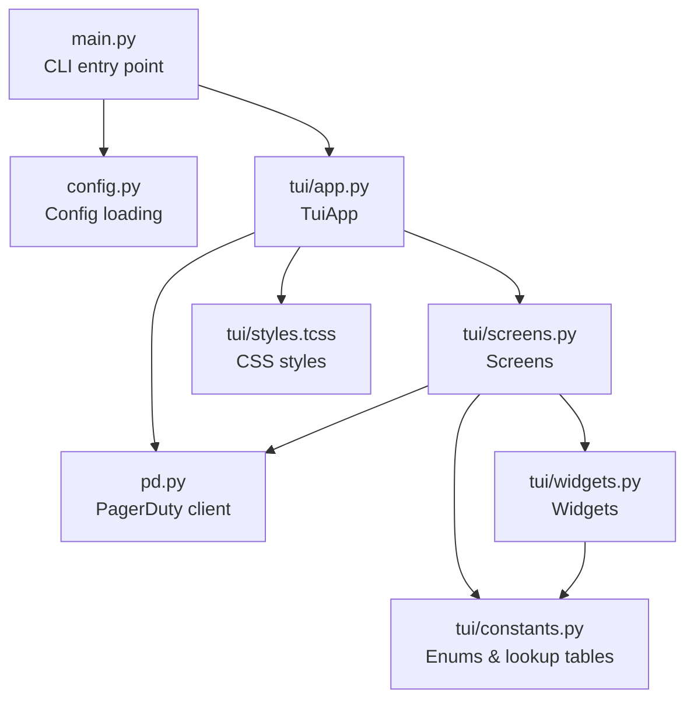
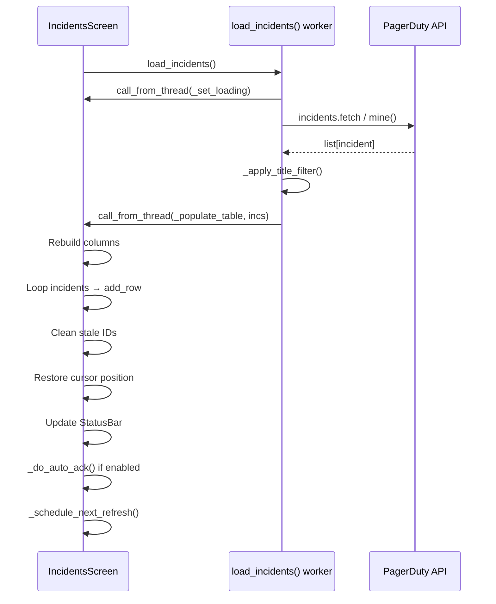
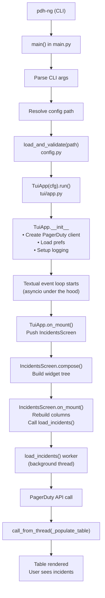

# Architecture

PDH-NG is a keyboard-driven terminal UI (TUI) for monitoring and managing PagerDuty incidents. It is written in Python using the [Textual](https://textual.textualize.io/) framework, which drives the terminal rendering and event loop, and the [pagerduty](https://pypi.org/project/pagerduty/) library for API access.

## Module map



## Entry point — `main.py`

`main()` is the CLI entry point registered as the `pdh-ng` command.

It accepts three optional flags:

| Flag | Effect |
|---|---|
| `-V` / `--version` | Print version and exit |
| `-c FILE` / `--config FILE` | Use an alternative config file (must exist) |
| `-d` / `--debug` | Force log level to `DEBUG` after config loads |

It resolves the config file path (explicit flag → `PDH_NG_CONFIG` env var → platform default), loads and validates config via `config.py`, then calls `TuiApp(cfg=cfg).run()` which blocks until the user quits.

## Config — `config.py`

`load_and_validate(path)` builds a `Config` object (a thin dict wrapper) in three steps:

1. **Parse YAML file** — silently ignored if the default path is missing; exits on malformed YAML
2. **Env var fallback** — for every key, checks `PDH_NG_<KEY_UPPERCASE>` if not present in the file; file takes precedence
3. **Validation + defaults** — exits with an error if any required key (`apikey`, `uid`, `email`) is still missing; applies `DEFAULTS` for optional keys


## PagerDuty API wrapper — `pd.py`

`PagerDuty` is a single shared client created once in `TuiApp.__init__`. Its constructor verifies credentials by calling `/abilities`, then exposes four sub-clients as attributes:

| Attribute | Class | Caching |
|---|---|---|
| `pd.incidents` | `Incidents` | None — always live |
| `pd.users` | `Users` | 30s TTL |
| `pd.services` | `Services` | None |
| `pd.teams` | `Teams` | 30s TTL |

**TTL caching pattern** (used by `Users` and `Teams`): The public method calls `ttl_hash()` at invocation time to get a 30-second bucket integer, then passes it to a `@lru_cache`-decorated private method. The bucket changes every 30 seconds, so the cache actually expires.

```
Users.get(id)          ← called by app code
  └─ _get_cached(id, ttl_hash())   ← @lru_cache keyed on (id, bucket)
```

**Key `Incidents` methods:**

| Method | Description |
|---|---|
| `fetch(userid, statuses, urgencies, teams)` | Generic list fetch |
| `mine(statuses, urgencies)` | Incidents assigned to the configured user |
| `ack(incs)` | Bulk acknowledge |
| `resolve(incs)` | Bulk resolve |
| `snooze(incs, duration)` | Snooze per incident |
| `reassign(incs, uids)` | Reassign per incident |
| `alerts(id)` | Alerts for one incident |

## TUI application — `tui/app.py`

`TuiApp` is a [Textual `App`](https://textual.textualize.io/api/app/) subclass. It owns two cross-screen resources:

- **`self.pd`** — the single `PagerDuty` client used by all workers
- **`self._prefs`** — an in-memory dict of UI preferences persisted to `~/.local/state/pdh-ng/ui.yaml`

**`__init__` sequence:**
1. Store config
2. Create `PagerDuty` client (auth check happens here)
3. Set prefs file path
4. Load persisted prefs from YAML (`_load_prefs()`)
5. Set up logging (`_setup_logging()`)

Each preference has a get/set property on `TuiApp`. Setters write to `_prefs` in memory only; `save_prefs()` flushes to disk and is called once when the main screen unmounts.

**`on_mount()`** pushes `IncidentsScreen`, passing all current prefs as constructor arguments.

## Screens — `tui/screens.py`

### `IncidentsScreen`

The main screen. It is **not** a subclass of `ModalScreen` — it occupies the full terminal.

**Compose layout:**
```
Header
DataTable  (id="incidents-table")
Input      (id="title-filter", hidden by default)
StatusBar  (id="status-bar")
Footer
```

**Lifecycle:**

| Method | What it does |
|---|---|
| `__init__` | Stores the prefs as local fields; initialises caches and selection sets |
| `compose()` | Builds the widget tree |
| `on_mount()` | Rebuilds columns; calls `load_incidents()` worker |
| `on_unmount()` | Calls `app.save_prefs()` |
| `on_screen_suspend()` | Stops refresh timer (detail screen opened) |
| `on_screen_resume()` | Restarts refresh timer (returned from detail screen) |

**Data loading flow:**



The worker is decorated `@work(exclusive=True, thread=True)` — only one fetch runs at a time. All UI updates from the worker go through `app.call_from_thread()` (available on `App` only in Textual 8.x).

**Filter cycle:** Each status-bar button cycles an enum and emits a message. `IncidentsScreen` handles the message, updates its local state and the app-level pref, then calls `load_incidents()` if the filter affects which incidents to fetch.

**Selection:** `_selected_ids` is a set of incident IDs. `action_toggle_select()` adds/removes the cursor incident. `action_ack_selected()` and `action_resolve_selected()` operate on the selected set (or just the cursor incident if nothing is selected).

**Symbol column** (leftmost, width 3): Three characters combined by `_row_marker(inc)`:
- Urgency: `▋` (red = high, blue = low) or space
- Auto-ack: `!` (bold yellow) if the incident was silently acked this cycle
- Selection: `✓` (bold green) if in `_selected_ids`

**Auto-refresh:** A one-shot `set_timer` fires after the API call completes (not on a fixed wall-clock interval). `_schedule_next_refresh()` cancels any live timer and arms a new one. The cycle is off → 3s → 5s → 10s.

**Auto-ack:** When enabled, `_populate_table` spawns `_do_auto_ack(incs)` which filters the already-fetched list client-side (no extra API call), acks matching incidents silently, posts a toast, and repopulates the table from the same list.

### `IncidentDetailScreen`

A full-screen detail view pushed on top of `IncidentsScreen` when the user presses Enter. It shows incident metadata and fetches its alerts in a background worker. Pressing Escape pops it off the stack, which triggers `on_screen_resume` on `IncidentsScreen`.

---

## Widgets — `tui/widgets.py`

### `StatusBar`

A horizontal bar docked below the `DataTable`. Contains five buttons and a count label.

Each button emits a typed message when cycled:

| Button | Message class | Payload |
|---|---|---|
| `1` scope | `ScopeChanged` | `IncScope` |
| `2` status | `StatusChanged` | `IncStatus` |
| `3` urgency | `UrgencyChanged` | `IncUrgency` |
| `4` auto-ack | `AutoAckChanged` | `bool` |
| `5` refresh | `RefreshTimeChanged` | `RefreshTime` |

The status label shows `N incident(s)` normally, `N incident(s) ↻` while loading, and an error in bold red on failure.

### `ColumnSelectorScreen`

A `ModalScreen` (overlay). Shows a checklist of all columns from `ALL_COLUMNS`. Dismiss returns the selected list (in column order) or `None` on cancel.

### `SnoozeDialog`

A `ModalScreen` with three duration buttons: 1 hour, 4 hours, 8 hours. Dismiss returns the chosen duration in seconds or `None` on cancel.

---

## Startup sequence



---

## Data flow — user changes a filter

```mermaid
flowchart LR
    A["Key press\ne.g. '1'"] --> B["action_cycle_scope()"]
    B --> C["StatusBar.cycle_scope()"]
    C --> D["Post ScopeChanged message"]
    D --> E["IncidentsScreen\n@on(ScopeChanged)"]
    E --> F["Update _inc_scope\nPersist to app.inc_scope"]
    F --> G["load_incidents() worker"]
    G --> H["PagerDuty API\nfetch / mine()"]
    H --> I["_populate_table()"]
    I --> J["DataTable re-rendered"]
```



---

## Key patterns

### Thread-safe workers

All PagerDuty API calls run in `@work(thread=True)` Textual workers (background threads). The Textual event loop is single-threaded (asyncio), so workers must not touch the UI directly. Instead they use `app.call_from_thread(method, *args)` to schedule UI updates on the main thread.

The `app` reference **must** be captured at the very first line of the worker:

```python
@work(thread=True)
def load_incidents(self) -> None:
    app = self.app   # capture before any await or network call
    app.call_from_thread(self._set_loading)
    incs = app.pd.incidents.fetch(...)
    app.call_from_thread(self._populate_table, incs)
```

This is necessary because `self.app` is a `ContextVar` lookup that can fail mid-execution after asyncio context changes.

### Message bus

Textual uses a message-passing system for cross-widget communication. `StatusBar` emits typed messages (e.g. `ScopeChanged`); `IncidentsScreen` listens with `@on(StatusBar.ScopeChanged)` handlers. This decouples the widgets from each other.

### One-shot refresh timer

`set_timer(interval, callback)` fires once. After each load completes, `_schedule_next_refresh()` arms a new timer. This means the countdown starts *after* the API call finishes, not on a wall-clock schedule, so the app never queues a refresh while a fetch is already running.

### Cursor visibility and action gating

The `DataTable` is initialised with `show_cursor=False`. The cursor only becomes visible through deliberate user input: navigation keys (`up`/`down`/`pageup`/`pagedown`) or a click on a row. This prevents an arbitrary incident from appearing "selected" after a reload changes the row order or when a fresh load populates a previously empty table.

All cursor-based actions (`action_inspect`, `action_toggle_select`, `action_open_url`, `_resolve_targets`) check `table.show_cursor` as their guard condition rather than `bool(_incident_ids)`.

`_populate_table` tries to restore the cursor to the same incident after a reload (by incident ID). If the incident is still present, `show_cursor` is preserved. If it has disappeared — or there was no prior cursor — `table.show_cursor` is set to `False`.

Selection (`_selected_ids`) and auto-ack (`_auto_acked_ids`) sets are reconciled with the new dataset via set intersection (`&=`) to remove stale IDs.

### Prefs persistence

UI preferences are loaded once at startup into `TuiApp._prefs`. Screen-level event handlers update `app.<pref>` (the TuiApp property setters) immediately so the state is always current. `save_prefs()` flushes the whole dict to YAML in a single write when `IncidentsScreen` unmounts (on quit).
